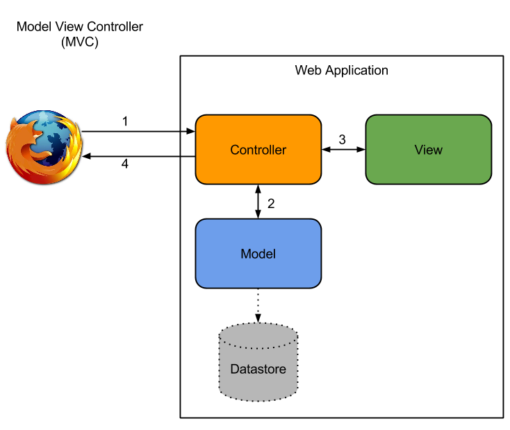

title: Rails Basics 02 : Views
author: Haris Dimitriou (xarisd)
description: An introduction to Views part of the MVC in Rails while building a simple web application
date: <%= Date.today %>
% available themes: Default - Sky - Beige - Simple - Serif - Night - Moon - Solarized
theme: Simple
% available transitions: // default/cube/page/concave/zoom/linear/fade/none
transition: linear
custom_css: presentation
% code-engine: coderay

# Rails Basics 02 : Views

Using Rails Views the proper way

!SLIDE
## Who am I?

&nbsp;

<h3 class="fragment">
  Haris Dimitriou (<strong>xarisd</strong>)
</h3>

&nbsp;

  Ruby developer...among other things

&nbsp;

  CTO and co-founder @<a href="http://www.polyptychon.gr">Polyptychon</a> (<a href="http://polyptychon.gr">polyptychon.gr</a>)

&nbsp;

  <a href="http://github.com/xarisd">github.com/xarisd</a>
   
  <a href="http://twitter.com/xarisd">twitter.com/xarisd</a>
   
  <a href="http://xarisd.io">xarisd.io</a>

!SLIDE
## Agenda

&nbsp;

* MVC Recap
* Layouts and Partials
* View Helpers
* Adding CSS and JavaScript to the Rails App
* Asset Pipeline : the very basics
* Reading data from JSON for the "Members" page
* Rendering semi-static pages from Markdown like the "Home" page

!SLIDE
## Things we will not cover

&nbsp;

* Advanced Layouts and Partials
* Advanced Asset Pipeline
* Controller filters and advanced concepts
* Advanced Routing (REST, nested routes etc)
* Models and Active Record
* Background Jobs
* ...

maybe next time(s)...

!SLIDE down-open
%%%%%%%%%%%%%%%%%%%%%%%%%%%%%%%%%%%%%%%%%%%
!SLIDE

## MVC : Recap

<% left do %>
  
<% end %>
<% right do %>
  <ol>
    <li class="fragment">Browser makes a <code>request</code></li>
    <li class="fragment"><code>Controller</code> recieves the request</li>
    <li class="fragment"><code>Controller</code> talks with the <code>Model(s)</code></li>
    <li class="fragment"><code>Controller</code> prepares the <code>View</code> for rendering</li>
    <li class="fragment"><code>Response</code> (HTML, JSON, etc) is returned to the Browser</li>
  </ol>
<% end %>

!SLIDE down-close

!SLIDE down-open
%%%%%%%%%%%%%%%%%%%%%%%%%%%%%%%%%%%%%%%%%%%
!SLIDE
## Things we will cover **next time**

&nbsp;

* Advanced Layouts and Partials
* Advanced Asset Pipeline
* Controller filters and advanced concepts
* Advanced Routing (REST, nested routes etc)
* Models and Active Record
* Background Jobs

&nbsp;

until next time...

!SLIDE down-close

!SLIDE down-open
%%%%%%%%%%%%%%%%%%%%%%%%%%%%%%%%%%%%%%%%%%%
!SLIDE
## Thank you!

&nbsp;

Liked the presentation?

&nbsp;

  Source: <a href="http://github.com/xarisd/rails-basics-02-views"> github.com/xarisd/rails-basics-02-views</a>

&nbsp;

  View it online: <a href="http://xarisd.io/presentations/rails-basics-02-views">xarisd.io/presentations/rails-basics-02-views</a>

&nbsp;

  Have something to say?

  Send me a tweet or direct message: <a href="http://twitter.com/xarisd">@xarisd</a>

&nbsp;

Questions?

